# Flow Control with Sliding window protocol

This project implements a **reliable file transfer protocol** built on top of the **User Datagram Protocol (UDP)**. It utilizes the **Selective Repeat** algorithm for flow control and error management. The User Interface (UI) is structured as a Terminal GUI application (TUI) using the **Textual** library.

## 🎯 Project Goal

The main objective is to demonstrate the ability to construct a virtual "reliable connection" over a fundamentally unreliable transport layer (UDP). This makes it suitable for applications requiring speed and fine-grained control over retransmissions.

---


## Demo<br/>
Main Menu<br/><br/>
<br/><br/>
Upload Menu<br/><br/>
<br/><br/>
Download Menu<br/><br/>
<br/><br/>
Move Menu<br/><br/>
<br/><br/>
Delete Menu<br/><br/>
<br/><br/>
Settings Menu<br/><br/>
<br/><br/>
---

## 📦 Packet Structure (Message Format)

All communications between the Client and Server use a strictly defined packet structure (UDP datagrams):

| Field             | Size          | Description                                                           |
|:------------------|:--------------|:----------------------------------------------------------------------|
| *PACKET\_TYPE*    | 1 byte        | Identifies the packet's overall purpose (Operation, ACK, Data, etc.). |
| *OPERATION\_TYPE* | 1 byte        | Details the specific operation or state (Upload, ACK, etc.).          |
| *SEQUENCE*        | 4 bytes       | Denotes packet order                                                  |
| *DATA*            | n - 6 bytes   | The payload or supplementary information.                             |


### 1. PACKET\_TYPE Encoding

| PACKET\_TYPE            | Code | Description                                               |
|:------------------------|:-----|:----------------------------------------------------------|
| *Operation*             | `0`  | A packet that initiates an action (e.g., Upload, Delete). |
| *ACK*                   | `1`  | Acknowledgment response.                                  |
| *Data*                  | `2`  | A packet carrying the actual file data.                   |
| *End of a transmission* | `3`  | Signals the end of a sequence of packets (a frame).       |

### 2. OPERATION_TYPE Encoding

This field is interpreted based on the preceding `PACKET_TYPE`:

| Context                       | OPERATION_TYPE          | Code | Description                                                                                  |
|-------------------------------|-------------------------|------|----------------------------------------------------------------------------------------------|
| *PACKET_TYPE 0 (Operation)* | Upload                  | 00   | Initiates a file upload.                                                                     |
|                               | Download                | 01   | Initiates a file download.                                                                   |
|                               | Delete                  | 02   | Requests file deletion.                                                                      |
|                               | Move                    | 03   | Requests file movement.                                                                      |
|                               | Sliding Window settings | 04   | Used to configure sliding window parameters.                                                 |
|                               | Get Hierarchy           | 05   | Request file hierarchy                                                                       |
| *PACKET_TYPE 1 (ACK)*         | ACK                     | 10   | Confirms successful receipt of a packet.                                                     |
| *PACKET_TYPE 2 (Data)*        | Data                    | 20   | Data packet. The first character of the DATA field **must be the packet's sequence number**. |
| *PACKET_TYPE 3 (END)*         | End of a transmission   | 30    | Denotes the end of a trasmission                                                             |

## 🚀 Client Protocol Documentation

This section describes the sequence of `Message` packets sent by the client for various operations, including file transfer and connection settings.

The message structure is `Message(PacketType, SequenceNumber, Data)`.

---

### 📥 Core Operations
Each stage is started by a _receive.start()_ call from the **server** and _sender.start()_ by the **client**.

| Operation | Stage | Packet Sequence | Description |
| :--- | :---: | :--- | :--- |
| **Upload** | **1** | `0. Message(PacketType.UPLOAD, 0, "")` | Initiates the upload process. |
| | | `1. Message(PacketType.DATA, 1, filename[0])` | Sends the first chunk of the filename. |
| | | `...` | ... |
| | | `k. Message(PacketType.DATA, k, filename[k-1])` | Sends the last chunk of the filename. |
| | **2** | `k+2. Message(PacketType.DATA, k+2, content[0])` | Sends the first chunk of actual file content. |
| | | `...` | ... |
| | | `k+n+2. Message(PacketType.DATA, ..., content[n-1])` | Sends the last chunk of file content. |
| **Download** | **1** | `0. Message(PacketType.DOWNLOAD, 0, "")` | Requests a file download. |
| | | `1. Message(PacketType.DATA, 1, filename[0])` | Sends the first chunk of the requested filename. |
| | | `...` | ... |
| | | `k. Message(PacketType.DATA, k, filename[k-1])` | Sends the last chunk of the requested filename. |
| **Move** | **1** | `0. Message(PacketType.MOVE, 0, "")` | Requests a file move/rename. |
| | | `1. Message(PacketType.DATA, 1, src_name[0])` | Sends first chunk of the **Source** path. |
| | | `...` | ... |
| | | `k. Message(PacketType.DATA, k, src_name[k-1])` | Sends last chunk of the **Source** path. |
| | **2** | `k+2. Message(PacketType.DATA, k+2, dest_name[0])` | Sends first chunk of the **Destination** path. |
| | | `...` | ... |
| | | `k+m+2. Message(PacketType.DATA, ..., dest_name[m-1])`| Sends last chunk of the **Destination** path. |
| **Delete** | **1** | `0. Message(PacketType.DELETE, 0, "")` | Requests file deletion. |
| | | `1..k. Message(PacketType.DATA, ..., filename[...])` | Sends filename chunks. |
| **Hierarchy**| **1** | `0. Message(PacketType.HIERARCHY, 0, "")` | Requests file hierarchy structure. |---

### ⚙️ Sliding Window Settings


To configure the underlying communication mechanism the following sequence is used:

| Packet Sequence                               | Purpose                               |
|:----------------------------------------------|:--------------------------------------|
| 1. `Message(PacketType.SETTINGS, 0, "")`      | Initiates the settings configuration. |
| 2. `Message(PacketType.DATA, 1, window_size)` | Sets the **window size**.             |
| 3. `Message(PacketType.DATA, 2, timeout)`     | Sets the **retransmission timeout**.  |


---
# User Datagram Protocol (UDP)

## 🌐 Overview

**User Datagram Protocol (UDP)** is a **Transport Layer protocol** within the Internet Protocol (IP) suite.  
It provides **fast**, **connectionless**, and **lightweight** communication between processes running on networked systems.

Unlike TCP, UDP does **not** guarantee:
- Delivery of packets  
- Order of packets  
- Error checking or correction  

This makes UDP ideal for **real-time** and **time-sensitive** applications, where **speed** is more important than reliability.

---

## ⚙️ Key Characteristics

| Feature | Description |
|----------|--------------|
| *Connectionless* | No connection setup before sending data. Each packet (datagram) is sent independently. |
| *Unreliable Delivery* | Packets may be lost, duplicated, or received out of order. |
| *No Congestion Control* | UDP sends data as fast as the application allows, without rate limiting. |
| *Low Latency* | Minimal protocol overhead makes it ideal for fast communication. |
| *Checksum Field* | Optional integrity check for detecting errors in transmission. |

---
## ⚙️ Flow Control

The project utilizes the **Sliding Window Protocol** specifically implemented as **Selective Repeat**.

* **Selective Repeat:** Only lost or corrupted packets are retransmitted, not the entire window.
* **Settings:** Parameters like the **window size** and **Timeout** interval are configurable via the Server UI.

## Sender-Receiver Interaction

<br/>

## Client-Server Packet Interaction

<br/>

## Client-Server Port Communication

```mermaid
flowchart LR
    %% Stiluri pentru noduri
    classDef client stroke:#01579b,stroke-width:2px;
    classDef server stroke:#4a148c,stroke-width:2px;

    subgraph CLIENT_SIDE [CLIENT]
        direction TB
        C_Sender("Sender<br>(Ascultă: 5000)<br>(Trimite către: 6000)"):::client
        C_Receiver("Receiver<br>(Ascultă: 7000)<br>(Trimite către: 8000)"):::client
    end

    subgraph SERVER_SIDE [SERVER]
        direction TB
        S_Sender("Sender<br>(Ascultă: 8000)<br>(Trimite către: 7000)"):::server
        S_Receiver("Receiver<br>(Ascultă: 6000)<br>(Trimite către: 5000)"):::server
    end

    %% Conexiunile (Săgețile din desen)
    %% Client Sender trimite la Server Receiver pe 6000
    C_Sender -- Port 6000 --> S_Receiver
    
    %% Server Receiver răspunde la Client Sender pe 5000
    S_Receiver -- Port 5000 --> C_Sender

    %% Server Sender trimite la Client Receiver pe 7000
    S_Sender -- Port 7000 --> C_Receiver

    %% Client Receiver răspunde la Server Sender pe 8000
    C_Receiver -- Port 8000 --> S_Sender
```

---

## 💻 User Interfaces (TUI - Terminal UI)

The application uses **Textual** to provide an interactive experience within the terminal.

### Client UI

* **START:** Initializes the connection and displays the operation options.
* **Operations:** `UPLOAD`, `DOWNLOAD`, `DELETE`, `MOVE FILE`, `SETTINGS`, `GET HIERARCHY`.
* **Workflow:** Allows file selection from a local file explorer, receiving the file hierarchy from the server, and sending the updated file structure after moving/deleting files.
* **Processing:** Displays progress status and logs of sent/received packets.

### Server UI

* **START SERVER:** Begins the UDP listening service.
* **SETTINGS:** Allows dynamic configuration of:
    * `size of window` (the size of the sliding window).
    * `Timeout` (the interval before a packet is considered lost and retransmitted).
* **PROCESS DATA:** Displays the activity log, received packets, and the status of ongoing transfer sessions.

---

## 🛠️ Installation and Running

## Prerequisites

Make sure you have **Python 3.11+** installed.  
You can check your Python version by running:

```bash
python --version
```

---

## Setup Instructions

1. **Clone the repository**

```bash
git clone https://github.com/TUIASI-AC-IoT/proiectrcp2025-biteater
cd proiectrcp2025-biteater
```

2. **Create a virtual environment (recommended)**

```bash
python -m venv venv
```

3. **Activate the virtual environment**

- On **Windows**:

```bash
venv\Scripts\activate
```

- On **macOS / Linux**:

```bash
source venv/bin/activate
```

4. **Install dependencies**

```bash
pip install textual
pip install textual-dev
```

5. a) **To Run the application on web**

```bash
textual serve Client.py
```
5. b) **To Run the application in terminal**

```bash
textual run Client.py
```

### To enter the developer mode (with print statements, events displayed and live css updates): ###

a. **Run in terminal 1**

```bash
textual console -x EVENTS -x SYSTEM
```


b. **Run in terminal 2**

```bash
textual run --dev Client.py
```

The console is going to only listen to events happening in terminal 2 

---

## Resources

- [UDP](https://www.geeksforgeeks.org/computer-networks/user-datagram-protocol-udp/)
- [Textual Documentation](https://textual.textualize.io/)
- [Textual GitHub Repository](https://github.com/Textualize/textual)


